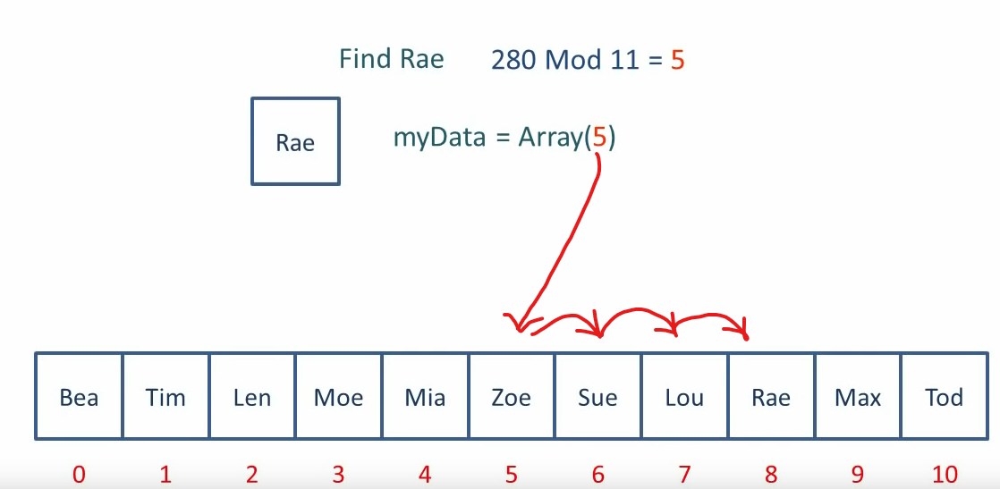
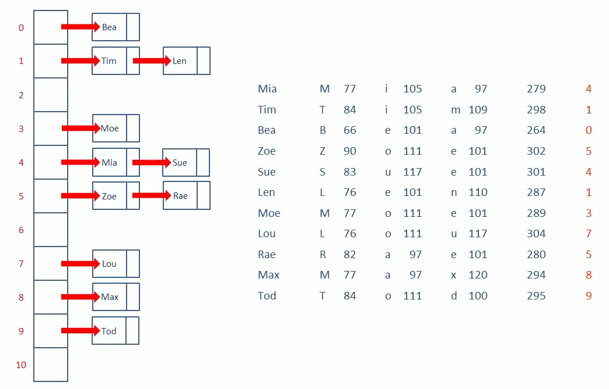

# Hashing in data retrieval
Hashing uses functions or algorithms to map object data to a representative
integer value. A hash can then be used to narrow down searches when locating these
items on that object data map.

An example structure would be a hash table.

Think of two ways to access data in an array. You have an array with multiple elements.
Now you want to get a certain value from it. For simplicity, let's say that the array
is filled with names. Each position holds one name.
1. If you want to get it from a specific location, then you'd have to go over each
   array position and compare it to the value that you are trying to find. For example,
   you want to find Ada. You then have to iterate over each position and do a string
   compare to see if that value matches. This can take a long time.
2. You already know the index of the element you want to access beforehand. No comparison
   has to be done. You just access the index and get the value.

Approach 2 is a lot faster. This can be implemented using hash functions. The value
would be the input to the hash function. The output would be the index.

An example to calculating the index. Suppose you have the name Mia. You take the ASCII
values of each letter and add them up. Then we divide them with the total number of
positions in the array. Let's say that it has a length of 11. We use the remainder of
that calculation to get the index.
```
M (77) + i (105) + a (97) = 279
279 mod 11 (array length) = 4 (the index that we insert into) 
```

The calculation above is just an example. The point is that each element is inserted
into a position by using a calculation.

In this context a hashing algorithm would be used to take in larger data and output
an integer that could be used for accessing. In other words, it is the calculation
applied to a key to transform it into an address.

With simplistic algorithms, there's a decent chance of getting collisions. A collision
would mean that running a hash function on different data would produce the same values.

Resolving a conflict by placing the item somewhere other than its calculated address
is called open addressing, because every location is open to any item. An example
would be linear probing, or linear search, where you find the next available slot,
which comes after your collision location. So if place 5 is taken, you look at 6,
if it's taken, you look at 7, until you find an empty slot.

When getting data with collisions, then you have to apply the same algorithm. Get the
index, see if it contains the correct data, if not, look at the next position and so on.



The more items there are in a hash table, the more likely you are to get collisions
as you enter more data. One way to deal with this is to make the hash table bigger
than needed. Perhaps so that only 70% of the table is only ever occupied. The
number of positions occupied is called the load factor.
````
Load Factor = Total number of items stored / Size of the array
````

If the table is implemented as a resizable structure, then it can be made to grow
once a certain threshold is passed.

As long as the load factor is sufficiently low, then linear probing should work
decently well.

Another way to deal with collisions is to use chaining, also known as closed addressing.
In that structure, each element is a pointer to the first element of a linked list that
contains the data.



To find elements from it, you'd calculate the index and then use standard linked list
traversal to find what you're looking for.

However, if the load factor is low, then it might actually be faster to use open addressing.

There are, of course, multiple different algorithms that can be used for resolving
collisions. All with their upsides and downsides.