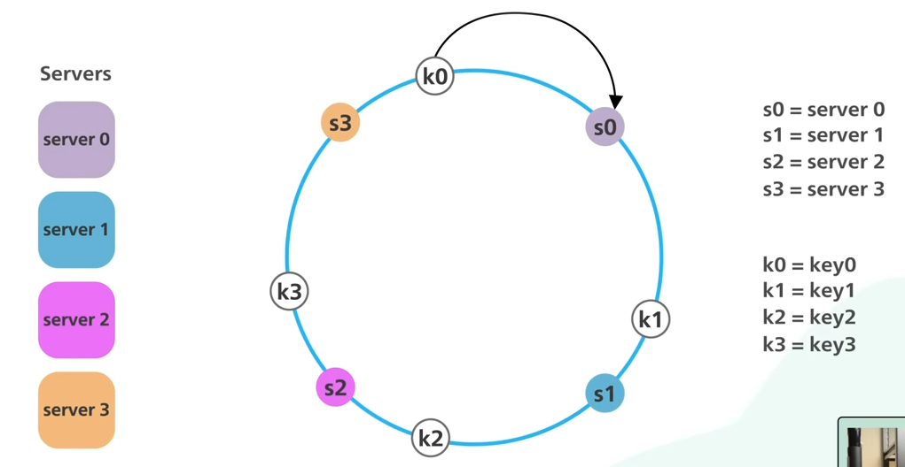
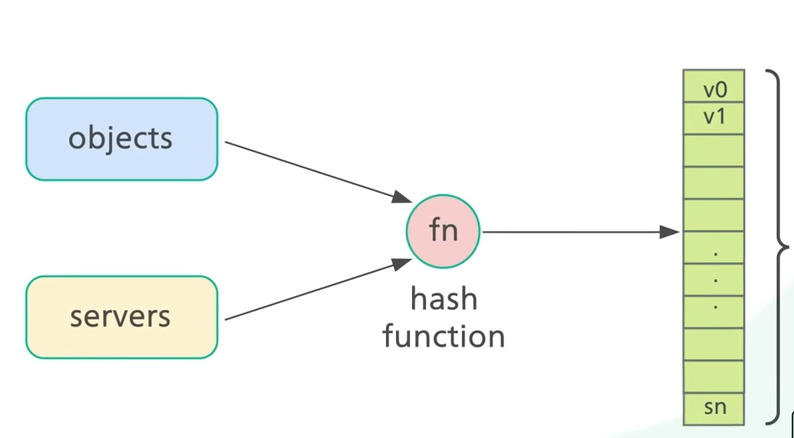
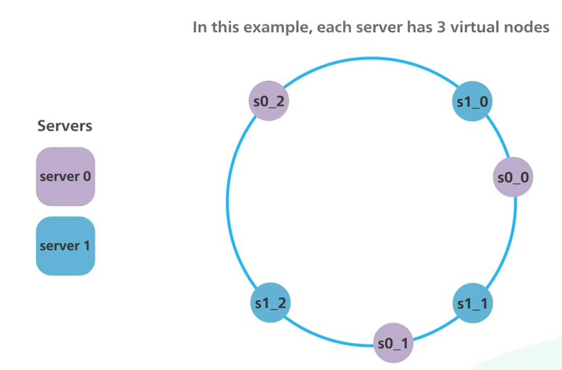

# Consistent Hashing
[Notes mainly made from here](https://youtu.be/UF9Iqmg94tk)

Imagine a ring (called a hash ring) with different placement locations. 

Incoming data gets run through a
hash function, resulting in a value. That value places it somewhere on the ring.

There are also servers. They get run through hash functions, and they are also placed
somewhere on the ring. We might use a server name or IP to hash.

When we want to find out who is serving an incoming request, we go clockwise to the 
nearest server on the ring.

When servers get added or removed, then all the hashes do not need to be recalculated.
Traffic will simply be re-routed based on what is next on the hash ring going clockwise.

There's an issue, though. We might get an unevenly distributed ring. And even if it
is initially equally distributed, then when a server drops, you'll have considerable
balance differences.

Virtual nodes are used to fix the above issue. A single server gets multiple nodes 
on the ring. For example 3 virtual nodes. In a real world scenario, the number of
virtual nodes is much larger than 3.

