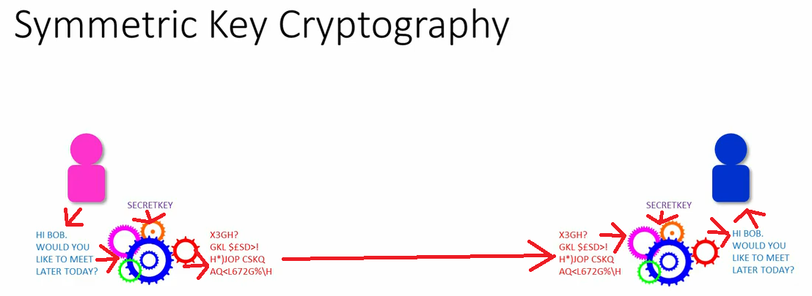
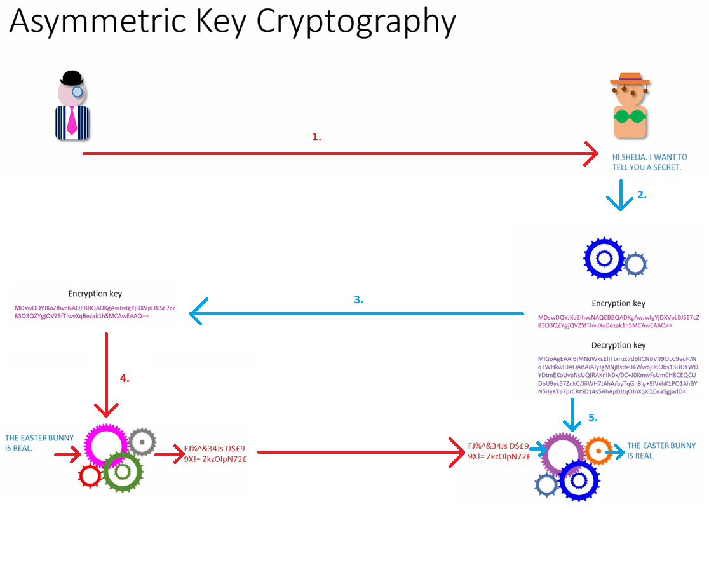

# Cryptography

[Notes made from here](https://www.youtube.com/watch?v=v8nlTZleKFw&list=PLTd6ceoshprcUyoyOQ_2dCvr5GPi5w_T7&index=2)

Cryptography is taking messages and scrambling them so no one else can understand them.
Unless they know how they have been scrambled.

The source text is often known as plain text and the encrypted text is called cipher text.

Converting plain text to cipher text is called encryption. Doing the reverse is called 
decryption.

There are two types to consider - symmetric and asymmetric.

## Symmetric key cryptography
The same key is used when doing encryption and decryption. If you know the key, 
then it's just a matter of reversing the process.

It's a rather fast process.

So what do we need:
1. The plain text message.
2. A set of steps to scramble the message, aka an algorithm. A set of steps specifically
for scrambling a message is called a cypher.
3. A secret key

How do we get the secret key to the other party?

## Asymmetric key cryptography
This works with different keys. One to encrypt the data (public key), and one to 
decrypt the data (private key).
For one encryption key, there is only one decryption key.

Anyone can have the encryption key, it doesn't matter, as there is only one key that
can decrypt the message. So there might even be a central repository for different 
public keys.

1. So one party sends a request to the other to start a communication.
2. The receiving party generates an encryption and a decryption key.
3. A copy of the encryption key is sent to the initiating party.
4. The initiating party uses that encryption key to encrypt the data to send.
5. The data is received and decrypted using the decryption key.

Asymmetric encryption is only good for small messages. However, to get around
this, symmetric keys can be used. The asymmetric mechanism could be used to exchange
symmetric keys and then the rest of the communication would happen using symmetric keys.

That is the usual use case for asymmetric cryptography - to exchange symmetric keys.

An additional point is, that it doesn't matter which key is used for encryption/decryption.
As long as the same pair is used. So if you encrypt using your private key, then it can
be decrypted using the public key. If you encrypt using the public key, then it can be
decrypted using the private key.