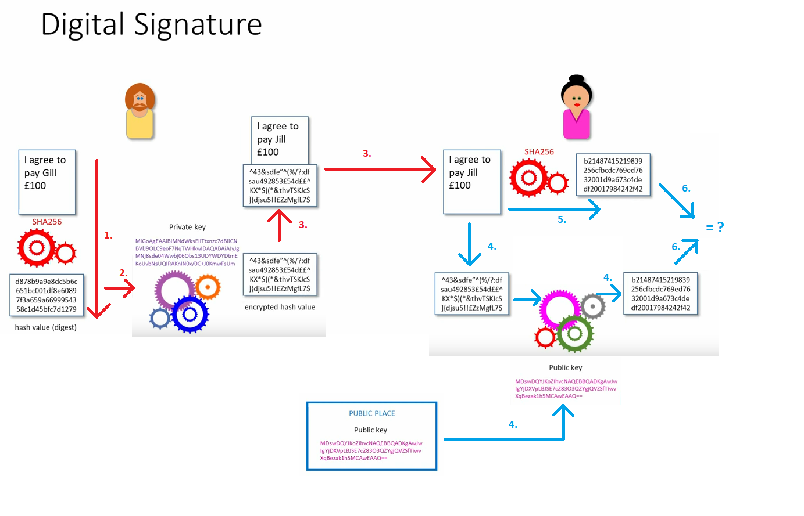
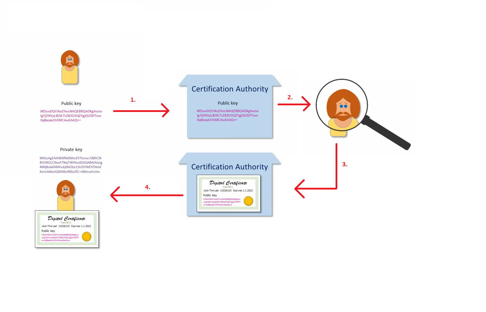

# Digital Signatures
The process of digital signatures involves hashing and asymmetric encryption.

One party wants to send data to another one.
1. First a hash value (digest) of that data is created using a hashing algorithm, for example SHA256.
Even the tiniest difference in the document would create a massive difference in the hash.
2. The message digest is then encrypted using the party's private key derived from 
asymmetric encryption. This results in an encrypted hash value.
3. The document is then sent over the wire, with the encrypted hash value included,
to the other party.
4. The receiving party then takes out the encrypted hash value and uses the senders
public key to decrypt the data. The public key can be sent via the message or be
queried from a public place. This way the receiver can be sure that the data was
sent by the sender.
5. Now the receiver has the hash that was generated from the document. This would
verify that the document that was signed by the sender, was indeed, what the receiver
has received. The receiver generates its own hash of the sent document and compares
it to the hash that was received from decryption.
6. The receiver compares the two hashes and if they match, then they can be sure that
what the sender signed, was the document with this specific content.

Now anyone could have been pretending to be the sender. If the public key was sent
with the message, then there's no certainty that the sender was, indeed, who they said
they were. You'd need a third party to verify the identity of the party.

This is where a Certification Authority comes in. This is a well known and a well trusted
third party. So the process looks something like this:
1. The sender sends their public key to the Certification 
Authority, along with various details about themselves. 
2. The Certification Authority
checks the details about the sender before adding their public key to their vault.
3. After the Certification Authority has verified all it needs, it then stores a
digital certificate into its vault.
4. Also send the certificate back to the sender.

Now when the sender sends the request, they can include the digital certificate with
it or let the receiver look it up themselves from a Certification Authority.

So the Certification Authority guarantees the public key belongs to the person.
Basically just vouches for the person.

Anything sent by a Certification Authority was signed using their own digital certificate.
That Certification Authority just vouched for by an even higher Certification Authority.